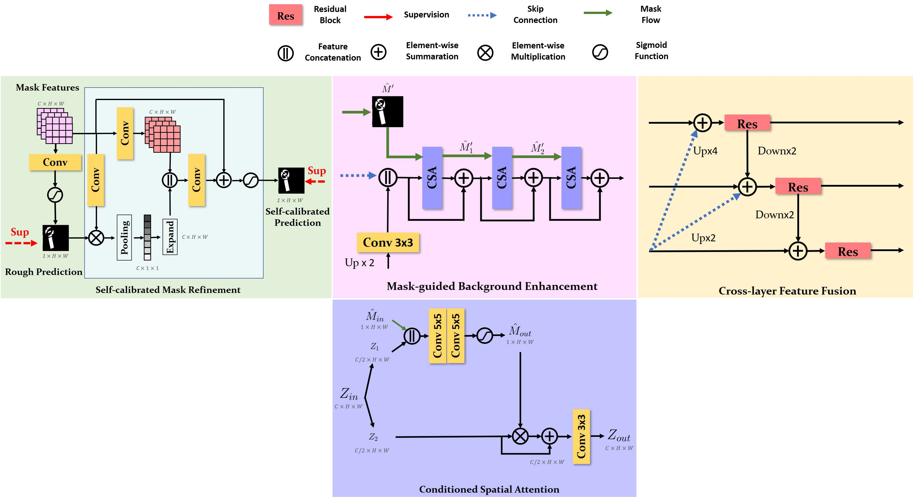
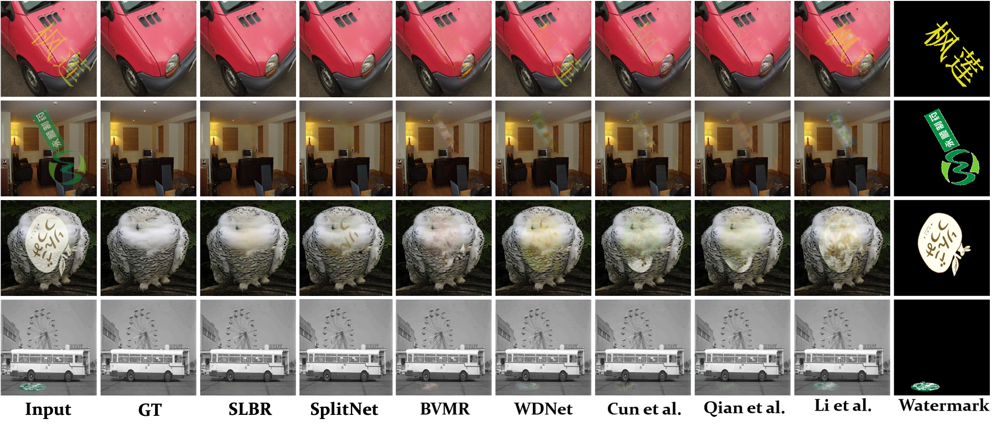

# Visible Watermark Removal via Self-calibrated Localization and Background Refinement
---

## Introduction
This is the official code of the following paper:

> 
> **Visible Watermark Removal via Self-calibrated Localization and Background Refinement**[[1]](#reference)
> <br>Jing Liang<sup>1</sup>, Li Niu<sup>1</sup>, Fengjun Guo<sup>2</sup>, Teng Long<sup>2</sup> and Liqing Zhang<sup>1</sup>
> <br><sup>1</sup>MoE Key Lab of Artificial Intelligence, Shanghai Jiao Tong University
> <br><sup>2</sup>INTSIG<br>
([ACM MM 2021](https://arxiv.org/pdf/2108.03581.pdf) | [Bibtex](#citation))


### SLBR Network
Here is our proposed **SLBR**(**S**elf-calibrated **L**ocalization and **B**ackground **R**efinement). Top row depicts the whole framework of SLBR and bottom row elaborates the details of our proposed three modules.
<div  align="center"> 

</div>
<div  align="center"> 

</div>


## Quick Start
### Install
- Install PyTorch>=1.0 following the [official instructions](https://pytorch.org/)
- git clone https://github.com/bcmi/SLBR-Visible-Watermark-Removal.git
- Install dependencies: pip install -r requirements.txt

### Data Preparation
In this paper, we conduct all of the experiments on the latest released dataset [CLWD](https://drive.google.com/file/d/17y1gkUhIV6rZJg1gMG-gzVMnH27fm4Ij/view?usp=sharing)[[2]](#reference) and LVW[[3]](#reference). You can contact the authors of LVW to obtain the dataset.


### Train and Test
- How to train and test my model?

  We provide an example of training and a test bash respectively:```scripts/train.sh```, ```scripts/test.sh``` 

  Please specify the checkpoint save path in ```--checkpoint``` and dataset path in```--dataset_dir```.

- How to test on my data?

  We also provide an example of a custom data test bash:
  ```scripts/test_custom.sh```
  And you can further tailor ```test_custom.py``` to meet your demands. For the best performance, it is better to finetune on your dataset since our training data size is set as 256x256.

### Pretrained Model
Here is the model trained on CLWD dataset:
- [Google Drive](https://drive.google.com/file/d/1uTCzubnWZtu3HIXaK8xsXX-7x302ss13/view?usp=sharing)

- [OneDrive](https://1drv.ms/u/s!AvQt5C5JE-WqkRkz9KI9o3OTfpZf?e=TDp9LV)

## Visualization Results
We also show some qualitative comparision with state-of-art methods:

<div  align="center"> 

</div>


## **Acknowledgements**
Part of the code is based upon the previous work [SplitNet](https://github.com/vinthony/deep-blind-watermark-removal)[[4]](#reference).

## Citation
If you find this work or code is helpful in your research, please cite:
````
@inproceedings{liang2021visible,
  title={Visible Watermark Removal via Self-calibrated Localization and Background Refinement},
  author={Liang, Jing and Niu, Li and Guo, Fengjun and Long, Teng and Zhang, Liqing},
  booktitle={Proceedings of the 29th ACM International Conference on Multimedia},
  pages={4426--4434},
  year={2021}
}
````

## Resources

We have summarized the existing papers, codes, and datasets on visible watermark removal in the following repository:
[https://github.com/bcmi/Awesome-Visible-Watermark-Removal](https://github.com/bcmi/Awesome-Visible-Watermark-Removal)


## Reference
[1] Jing Liang, Li Niu, Fengjun Guo, Teng Long and Liqing Zhang. 2021. Visible Watermark Removal via Self-calibrated Localization and Background Refinement. In *Proceedings of the 29th ACM International Conference on Multimedia*. [download](https://arxiv.org/pdf/2104.09453.pdf)

[2] Liu, Yang and Zhu, Zhen and Bai, Xiang. 2021. WDNet: Watermark-Decomposition Network for Visible Watermark Removal. In *Proceedings of the IEEE/CVF Winter Conference on Applications of Computer Vision.*

[3] Danni Cheng, Xiang Li, Wei-Hong Li, Chan Lu, Fake Li, Hua Zhao, and WeiShi Zheng. 2018. Large-scale visible watermark detection and removal with deep convolutional networks. In *Chinese Conference on Pattern Recognition and Computer Vision*. 27–40.

[4] Xiaodong Cun and Chi-Man Pun. 2020. Split then Refine: Stacked Attentionguided ResUNets for Blind Single Image Visible Watermark Removal. arXiv preprint arXiv:2012.07007 (2020).
